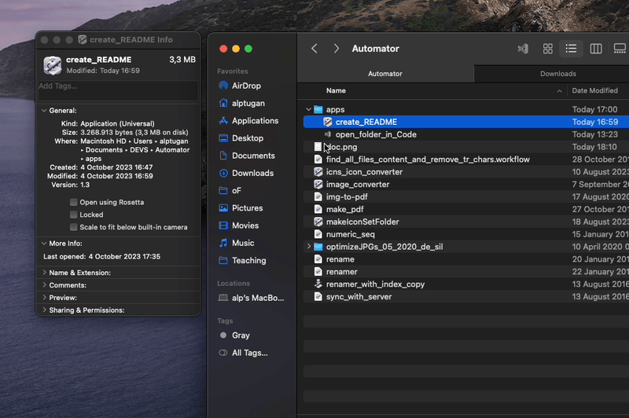
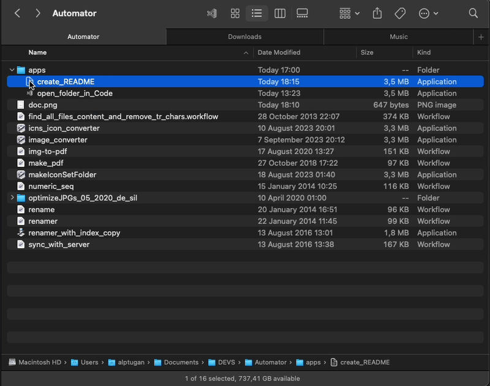

# Background

🚀 This repo includes a set of tools, what I call Atomic Apps, that can boost your productivity while working on your Mac 💻. I use these apps every day to automate repetitive tasks 🔄 and save time ⏰. Give them a try and see how they can revolutionize your workflow 🤖!

You can read more about Atomic Apps and how to create your own on my [Medium Article 📖 ](https://medium.com/@alptuan/automate-common-tasks-on-mac-with-atomic-apps-boost-your-productivity-352e83be9936)

# What are Atomic Apps?

💻 Atomic Apps are small, customized applications created using the Automator app on your Mac 🤖. These apps are designed to automate specific tasks and can be easily accessed by attaching them to the Finder window's toolbar 🚀. The best part? The Automator app is included with macOS, making it easy for anyone to create their own custom apps! 🙌
With Automator, you can run Shell commands, launch applications, run scripts, and more, allowing you to configure even the most complex tasks with ease ⚙️. Whether you're looking to streamline your workflow or just want to save time on repetitive tasks, Atomic Apps can help you work more efficiently and effectively 💪. So why not give it a try and see how it can transform the way you work? 😃

# Atomic App List

Here's a list of the currently available Atomic Apps that you can download from the [Releases](https://github.com/alptugan/Atomic-Apps/releases/tag/v1.0) 📦  page and start using right away!

| Name            | Description |
| ----------------: |:----------- |
| create_README 📝 | Creates a ReadMe.md file in the current directory and opens it in Visual Studio Code. |
| open_folder_in_Code 📁 | Opens the current directory in Visual Studio Code.|
Upcoming Atomic App ❔ | Description |

# Installation

1. Download the app from the [Releases](https://github.com/alptugan/Atomic-Apps/releases/tag/v1.0) 📦  page or create one referring to the [Medium Article 📖 ](https://medium.com/@alptuan/automate-common-tasks-on-mac-with-atomic-apps-boost-your-productivity-352e83be9936).

2. You can change the icon of the app as follows;

3. Hold down the ⌘ key, click and drag the app to the Finder Toolbar as follows.

# Build Atomic Apps Using Automator

Follow the tutorial on my [Medium Article 📖 ](https://medium.com/@alptuan/automate-common-tasks-on-mac-with-atomic-apps-boost-your-productivity-352e83be9936) to learn how to build an Atomic App using Automator.

